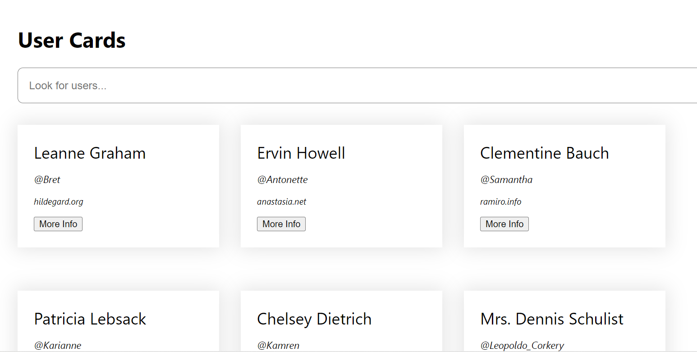
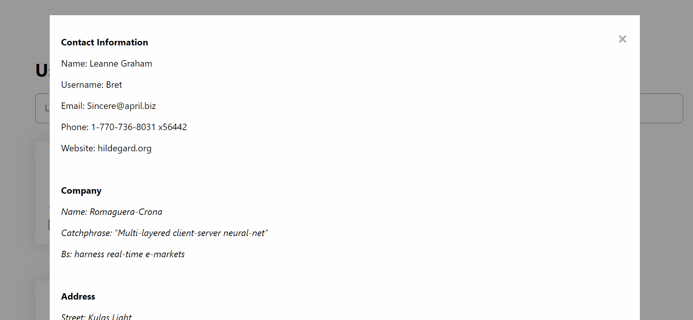

# Integrify Pre-assignment

## _A React-based User card Project_ 





This simple react project displays basic user information in cards, which, upon clicking- shows additional details for each individual user. 




Buttons are functional and display the information from each individual's user card.


## Installation (IntelliJ Idea recommended)

- Copy repository to IDE

- Install node.js 

- Integrate Git Bash to Intellij terminal

- Install react application with the following:

```
npm i
``` 
 
```
npm run build
``` 


- Run the react app by changing directory to 'frontend' folder
```
cd frontend

npm run start
```


# To do:

Project Completed.

All functionalities implemented and working properly. 
